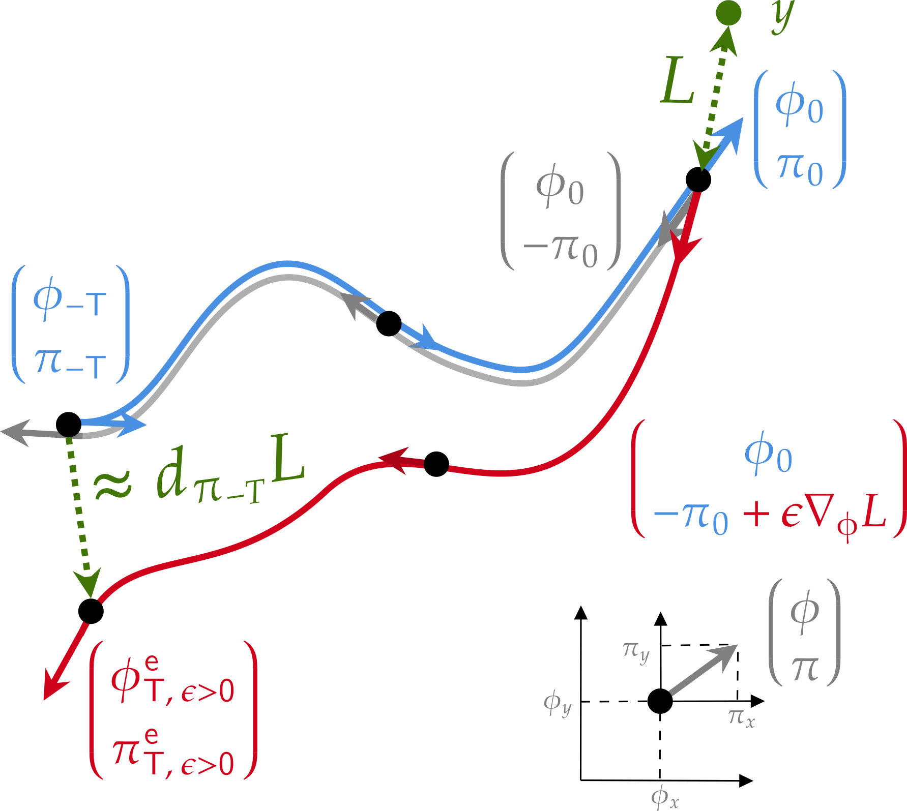

# Learning long range dependencies through time reversal symmetry breaking (NeurIPS 2025, oral)

This  repository contains the official implementation for the paper [Learning long range dependencies through time reversal symmetry breaking](https://arxiv.org/abs/2506.05259) by [Guillaume Pourcel](https://guillaumepourcel.github.io/) and [Maxence Ernoult](https://scholar.google.com/citations?user=wGB7cpUAAAAJ&hl=fr).

This repository is an extension of [https://github.com/tk-rusch/linoss](https://github.com/tk-rusch/linoss). 

--------------------

We propose Recurrent Hamiltonian Echo Learning (RHEL), a forward-only proxy of BPTT, which applies to dissipative-free Hamiltonian systems. It leverages the time-reversal symmetry of Hamiltonian systems, and encodes gradients through trajectory differences when this symmetry is "broken" by error signals. We evaluate RHEL on bespoke SSMs and show it remains on par with BPTT on long-range tasks.

RHEL thus points toward alternative compute paradigms where learning and inference are realized through the same underlying physical dynamics.

<div align="center">
  
</div>

## Requirements

This repository is implemented in python 3.10 and uses Jax as their machine learning framework.

### Environment

TBD

---

## Data

The folder `data_dir` contains the scripts for downloading data, preprocessing the data, and creating dataloaders and 
datasets. Raw data should be downloaded into the `data_dir/raw` folder. Processed data should be saved into the `data_dir/processed`
folder in the following format: 
```
processed/{collection}/{dataset_name}/data.pkl, 
processed/{collection}/{dataset_name}/labels.pkl,
processed/{collection}/{dataset_name}/original_idxs.pkl (if the dataset has original data splits)
```
where data.pkl and labels.pkl are jnp.arrays with shape (n_samples, n_timesteps, n_features) 
and (n_samples, n_classes) respectively. If the dataset had original_idxs then those should
be saved as a list of jnp.arrays with shape [(n_train,), (n_val,), (n_test,)].

### The UEA Datasets

The UEA datasets are a collection of multivariate time series classification benchmarks. They can be downloaded by 
running `data_dir/download_uea.py` and preprocessed by running `data_dir/process_uea.py`.

### The PPG-DaLiA Dataset

The PPG-DaLiA dataset is a multivariate time series regression dataset,
where the aim is to predict a person’s heart rate using data
collected from a wrist-worn device. The dataset can be downloaded from the 
<a href="https://archive.ics.uci.edu/dataset/495/ppg+dalia">UCI Machine Learning Repository</a>. The data should be 
unzipped and saved in the `data_dir/raw` folder in the following format `PPG_FieldStudy/S{i}/S{i}.pkl`. The data can be
preprocessed by running the `process_ppg.py` script.

---

## Experiments

The code for training and evaluating the models is contained in `train.py`. Experiments can be run using the `run_experiment.py` script. 
This script requires you to specify the names of the models you want to train, 
the names of the datasets you want to train on, and a directory which contains configuration files. By default,
it will run the LinHRU experiments. The configuration files should be organised as `config_dir/{model_name}/{dataset_name}.json` and contain the
following fields:
- `seeds`: A list of seeds to use for training.
- `data_dir`: The directory containing the data.
- `output_parent_dir`: The directory to save the output.
- `lr_scheduler`: A function which takes the learning rate and returns the new learning rate.
- `num_steps`: The number of steps to train for.
- `print_steps`: The number of steps between printing the loss.
- `batch_size`: The batch size.
- `metric`: The metric to use for evaluation.
- `classification`: Whether the task is a classification task.
- `lr`: The initial learning rate.
- `time`: Whether to include time as a channel.
- `num_blocks`: The number of model blocks.
- `hidden_dim`: The hidden dimension of the model.
- `ssm_dim`: The SSM dimension.
- `complex_ssm`: Whether to use a complex SSM (only for LinHRU).
- `train_steps`: Whether to train the step sizes (only for LinHRU).

See `experiment_configs/repeats` for examples.

---

## Reproducing the Results

The configuration files for all the experiments with fixed hyperparameters can be found in the `experiment_configs` folder and
`run_experiment.py` is currently configured to run the repeat experiments on the UEA datasets.


Tor reproduce the Figure 4 of the paper, run `python gradient_comparison_bptt_rhel.py`. This will generate the gradient plots for LinHRU and NonlinHRU on a sample from the SCP1 dataset.

---

# Citation
If you found our work useful in your research, please cite our paper at:
```bibtex
@misc{pourcel2025learninglongrangedependencies,
      title={Learning long range dependencies through time reversal symmetry breaking}, 
      author={Guillaume Pourcel and Maxence Ernoult},
      year={2025},
      eprint={2506.05259},
      archivePrefix={arXiv},
      primaryClass={cs.LG},
      url={https://arxiv.org/abs/2506.05259}, 
}
```
(Also consider starring the project on GitHub.)
